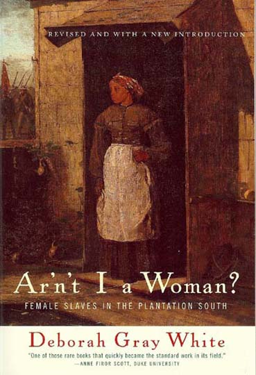
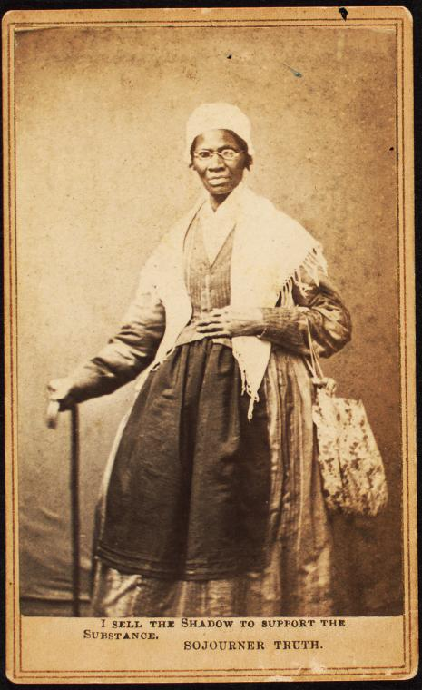

_Below is the full-text of the talk I gave at the [Organization of American Historians Annual Meeting](http://www.oah.org/) last week. The panel was titled ["Expanding the Boundaries: Power and Voice in African American Women's and Gender History."](http://diasporahypertext.com/2014/04/09/friday-me-jmjafrx-discussing-voice-and-power-at-oah2014/) A separate reflection on the panel itself is incoming._

\[caption id="attachment\_2282" align="aligncenter" width="670"\] Stephanie M. H. Camp\[/caption\]

_My original remark_s explored power and voice in histories of slavery and Afro-Atlantic women.__

__It quickly became a tribute to [Deborah Gray White](http://history.rutgers.edu/faculty-directory/192-white-deborah) and the recently passed [Stephanie M. H. Camp](http://seattletimes.com/html/localnews/2023350124_obitcampxml.html).__

_I edited the text below for the blog-as-media and easier reading. I used formatting to replicate speech patterns, added images and links where appropriate, and included sections I skipped last Friday for the sake of time. Overall, however, I stayed true to the text as shared that day._

_You are welcome to reblog, cite, circulate at will. All I ask is you respect the terms of the [Creative Commons license](http://creativecommons.org/licenses/by-nc-sa/3.0/). If you reblog/reprint, reblog/reprint in its entirety and cite/link back to this blog as the original source [(for more click here)](http://diasporahypertext.wordpress.com/citation). And if you have questions or concerns about anything I wrote, [email at will](mailto:jmj@msu.edu)._

_Thank you everyone for your warm remarks and feedback last weekend. Thank you blog visitor for reading._

_And, of course, thank you Stephanie Camp for being an example to a young black woman trying to find her way in the academy, for your fearless scholarship and your brilliance. These words are dedicated to you. Rest in peace._

\_\_\_\_\_\_\_\_\_\_\_\_\_\_\_

\[Mic check\]

I'd like to start with heartfelt thank yous to the [OAH Committee on the Status of Women in the Profession](http://www.oah.org/about/governance/committees/service-committees/) for sponsoring this panel, especially [Susan Lee Johnson](http://history.wisc.edu/people/faculty/johnson.htm) and [Dayo Gore](http://www.ethnicstudies.ucsd.edu/faculty/gore.html) for organizing it. Thank you also to my co-panelists [Kathryn Silva Banks](http://www.andrews.edu/cas/history/faculty/banks_kathryn.html), [Brenna Greer](http://www.wellesley.edu/history/faculty/greer), [Sarah Haley](http://www.genderstudies.ucla.edu/people/faculty/Sarah-Haley), [Kwame Holmes](http://www.colorado.edu/ethnicstudies/people/holmes/index.html), and [Barbara Krauthamer](https://www.umass.edu/history/people/faculty/krauthamer.html). It is an honor to appear among you.

I rewrote my remarks in light of Stephanie M. H. Camp's untimely death. As a result, the talk I give today is rather new, a work-in-progress. I welcome discussion, feedback, and critique.

When asked to consider power and voice in African American women's and gender history, I turned to two books that have inspired me, pushed me, and fostered my growth as a historian, scholar, writer, and thinker.

### **One is the second edition of Deborah Gray White's [_Ar'n't I a Woman: Female Slaves in the Plantation South_](http://www.amazon.com/gp/product/0393314812/ref=as_li_ss_tl?ie=UTF8&camp=1789&creative=390957&creativeASIN=0393314812&linkCode=as2&tag=iwann-20).**

\[caption id="attachment\_2299" align="alignright" width="292"\] Deborah G. White, Ar’n’t I a Woman?: Female Slaves in the Plantation South. 2nd ed. New York: W.W. Norton, 1999.\[/caption\]

_Ar'n't I a_ _Woman_ mined the archives--the Works Progress Administration's ex-slave narratives, 19th century autobiographies of former slaves, slaveowners' diaries, and travel narratives--for the VOICES of black women speaking about their experiences as slaves in the U.S. South during the first half of the 19th century, through the Civil War, and into the first decades of emancipation.

As the first book-length study focused entirely on female slaves in the United States, it was a work so pathbreaking, its existence led (one could say forced, on could say emPOWERed) Library of Congress subject cataloguers to create a new subject heading: "Female Slaves." Enslaved women were officially added to the list of Library of Congress subject headings in March of 1985.[1](#f1)

White was among a vanguard of historians of African American women the [Association of Black Women Historians](http://www.abwh.org/) in 2012 dubbed ["Founders of the Field."](http://www.abwh.org/index.php?option=com_content&view=article&id=115&Itemid=163) Women like [Evelyn Brooks Higginbotham](http://history.fas.harvard.edu/people/faculty/higginbotham.php), [Darlene Clark Hine](http://www.afam.northwestern.edu/people/darlene-clark-hine.html), [Rosalyn Terborg-Penn](http://www.thehistorymakers.com/biography/rosalyn-terborg-penn-38), [Elsa Barkley Brown](http://wmst.umd.edu/people/core-faculty/elsa-barkley-brown), and more, lent power and voice to BOTH the need for African American women and gender histories of the 18th, 19th, and 20th centuries AND the need to support, mentor, and encourage black female historians as mouthpieces, oracles, and "portals"--writers of a history that was never meant to survive.[2](#f2)

In 2007, _Ar'n't I a_ _Woman_ celebrated its 25-year anniversary, commemorated in a [_Journal of Women's History_](http://muse.jhu.edu/journals/journal_of_womens_history/v019/19.2berry.html) forum by a new generation of historians of women, gender, and bondage. Words of celebration and reflective critique expressed by [Daina Ramey Berry](http://www.drdainarameyberry.com/about/), [Leslie Harris](http://history.emory.edu/home/people/faculty/harris.html), Barbara Krauthamer, [Jessica Millward,](http://www.humanities.uci.edu/history/faculty_profile_millward.php) [Jennifer Morgan](http://sca.as.nyu.edu/object/JenniferMorgan), and the recently deceased [Stephanie M. H. Camp](https://depts.washington.edu/history/people/9) underscored ways _Ar'n't I a_ _Woman_ has stood the test of time.

But their voices, raised in an elite academic journal (one of the nodes of POWER in our profession), also represented a broadening kinship network of historians, many of them women of color. Invested in digging deeper and faced with the raw challenge of making enslaved and free women of African descent more legible, these scholars also struggled with whether such a pursuit was possible or justified given the limits of the archive.

This brings me to the second text I turned to and turn to when considering the relationship between power and voice, the work we do as historians of African American women, race, and gender, and the work I do as a scholar of slavery.

### **Stephanie M. H. Camp's [_Closer to Freedom: Enslaved Women and Everyday Resistance in the Plantation South_](http://www.amazon.com/gp/product/0807855340/ref=as_li_ss_tl?ie=UTF8&camp=1789&creative=390957&creativeASIN=0807855340&linkCode=as2&tag=iwann-20)** literally mapped a "rival geography"--a black _female_ geography--of resistance onto the U.S. South.

\[caption id="attachment\_2297" align="alignleft" width="208"\] Stephanie, M. H. Camp. Closer to Freedom: Enslaved Women and Everyday Resistance in the Plantation South. University of North Carolina Press, 2004\[/caption\]

_Closer to Freedom_ built on __Ar'n't I a_ _Woman__ in important ways. __Ar'n't I a_ _Woman__ forced modern scholars to confront the VISIBILITY of enslaved women in the archive and their attendant visibility on plantations. It touched on all aspects of southern life from slaveowners struggling to organize complicated labor regimes by gender and age, to enslaved women navigating, with enslaved men and children, household and community dynamics on and across plantations or in cities, to women escaping bondage to become 'free women of color.' __Ar'n't I a_ _Woman__ even tackled the iconography of the 'black woman,' suggesting black women's hypervisibility and symbolic labor was central to the mythology of postbellum southern society, reappearing in tropes of "Jezebel," "Mammy," and, later, "Sapphire."[3](#f3) White did more than turn her attention to where enslaved women appeared in the archive. She demonstrated how the category of the black woman was constructed against and within categories of free and slave, propertied and unpropertied, urban and rural, and more.[4](#f4)

Camp's work drew on a similar archive of voices and material but painted a picture of enslaved women's INVISIBLE world--the terrain enslaved women inhabited within the boundary of the plantation and slaveowners' 'geography of containment.' As property on property they did not own, enslaved women engaged in truancy (running away for short distances and time periods) to defy slaveowners' regulations. Camp revealed how enslaved women transgressed with relish as part of a larger politics of pleasure and play that allowed them to reclaim their bodies as sites of contestation. This politics of pleasure and play included illicit gatherings and the movement, singing, and flirting that occurred at such secret parties. It also included the landscape and material culture of the slave quarters where, through conventions of gender and circumstance, enslaved women stole a bit of time and space from slaveowners. When they adorned their walls and their bodies as they saw fit, enslaved women exacted some, if infinitesimal, amounts of control over their own lives. In at least one Mississippi case, doing so brought sectional politics into the heart of slaveowners' domain when an enslaved woman named California adorned her cabin with 'amalgamation prints' or print material circulated by pro-slavery advocates portraying abolitionists as 'race-mixers.'[5](#f5)

Camp, as White had years before, described excavating early African American women's lives as requiring a special effort. For Camp, this meant remaining attuned to the everyday:

> **"Turning our attention to the everyday, to private, concealed, and even intimate worlds, is essential to excavating bondwomen's resistance to slavery because women's history does not merely add to what we know; it changes what we know and how we know it."**[6](#f6)

Turning _her_ attention to the everyday led Camp to the central role gender (not just women) played in enslaved women's determination and ability to survive and resist slavery across time and space, whether slaves were mobile or remained in place.

That understanding of the everyday politics of gender in the plantation South meant attending an illegal party was no longer just an outlet for slaves caught in a master-slave dialectic. Attending illegal parties became opportunities to recement affective ties, reaffirm kinship connections (and disconnections), relearn forests and patrol patterns, and recondition bodies pushed beyond endurance. Suddenly, illegal parties were no longer a matter of popping the top and letting off steam. They were subversive events laying the groundwork for individual and organized resistance. And it is this lens on play that can change "what we know and how we know" the history of women and gender histories of race regardless of whether we are studying gatherings in the 18th century or the 21st.

\_\_\_\_\_\_\_\_\_\_\_\_\_\_\_

Two texts. One history in which the voices of black women are central, vocal, lifted. Another history in which black women's voices are also lifted but black women "speak" through and in a variety of other ways--voting with their feet, dancing with their hips, beautifying their living spaces. Both exemplify, for me, the intersection of power and voice in three important ways.

### **First, they remind me there is revelatory potential in finding the VOICES of enslaved women because those voices have the POWER to create ecstatic moments of connection.**

This ecstatic connection--like meeting friends and kinfolk at an illegal dance--can foster a broader politics of social justice, consciousness, and commentary. For example--

 

\[caption id="attachment\_2301" align="aligncenter" width="352"\] 1864 Carte-de-viste of Sojourner Truth. Caption: "I sell the shadow to support the substance. Sojourner Truth." Schomburg Center for Research in Black Culture / Photographs and Prints Division \[Click through for more\]\[/caption\]White's book took as its namesake the speech given in 1851 at the Women's Rights Convention in Akron, OH by former slave, activist, and abolitionist Isabella Baumfree--known more often today as Sojourner Truth, the name she eventually took as her own. This, although White, in the preface to her second edition, acknowledged ways Truth's speech as it comes down to us has been rewritten, summarized, reinterpreted, and embellished.

Camp, in her tribute to White, noted:

> **"That Truth did not actually say those words, as we now know, does not change the fact that the message articulated beautifully one of the main lessons learned by U. S. feminists in the 1970s and 1980s."**[7](#f7)

The lesson? That _Some of Us Are Brave_.[8](#f8)

Like [Margaret Washington](http://www.amazon.com/gp/product/0252078012/ref=as_li_ss_tl?ie=UTF8&camp=1789&creative=390957&creativeASIN=0252078012&linkCode=as2&tag=iwann-20) and [Nell Irvin Painter](http://www.amazon.com/gp/product/0393317080/ref=as_li_ss_tl?ie=UTF8&camp=1789&creative=390957&creativeASIN=0393317080&linkCode=as2&tag=iwann-20), who have each written recent biographies of Truth, Camp was not convinced knowing or not knowing the true and exact words used by Truth diminished her speech as a fulcrum historians of African American women, race, and gender might use to push the field of (women's) history beyond binaries and internal divisions, into the silent, quiet spaces where black women lie.

That the archive is gendered--in other words, that it does not give VOICE or POWER indiscriminately but instead privileges certain VOICES as a result of the attendant social and political POWER those voices held at a given time period--is a fact historians of black women's and gender history have struggled over for some time. Neither White nor Camp disputed this. However, both also insisted historians would only embark on a journey with enslaved and free women of color by practicing a disciplinary truancy of their own--by racing defiantly across the boundaries of the historical profession into methodologies, historiographies, and tools used by those working in the fields of geography, feminist theory, material culture, and archaeology. And today, to these fields, I would add literature, legal studies, black studies, queer studies, digital and critical media studies. Rather than a hard barrier, the limit of the archive became an enclosure historians need to breach.

In other words, the definition of VOICE is itself a casualty of slaveholding regimes. But if we are to take seriously that black women LIVED beyond the dictates of the physical, reproductive, and sexual labor they were forced to perform for slaveowners and enslaved men, then even if the voices do not always come clearly or cleanly through in text...in non-text, in the corporeal and the quotidian, black women _might still be speaking._

### **Second: _Ar'nt I a Woman_ and _Closer to Freedom_ remind me VOICE is genealogical.**

White invoked Truth's words in her text. Camp paid tribute to White and built on her labor. I came to these remarks after hearing of Stephanie Camp's death. When I returned to my copy of _Closer to Freedom_, assigned while I was a graduate student, I discovered between its pages notes taken during my first research seminar, a course led by Elsa Barkley Brown.

\[caption id="attachment\_2310" align="aligncenter" width="225"\] Meeting Notes (or, Speaking Voice...) Spring 2005. Camera phone upload April 17, 2014. / Jessica Marie Johnson\[/caption\]

At the heart of our craft are the conversations we have with each other. But at the heart of doing African American women's and gender history is the kinship, trust, and intimacy we build _with and among each other_.

Camp's exploration of black women's bodies and homes as sites of oppression and resistance built on White's work and reminded us black women's sartorial politics, expressive culture, play, and, yes, even their kitchen table, are historical subjects which MUST be studied if we want to know anything about black women's lives and politics during the period of slavery.

And scholars continue to use White and Camp's insights as a baseline in their work. Amrita Myers, for example, describes how free women of color leveraged free status against the limited "social space" race and gender afforded them in antebellum Charleston.[9](#f9) In my own work, I reach out to _Ar'n't I a Woman_ as a lifeline and guide to help me understand women born in West Africa but living and traveling between West Africa, Saint-Domingue, Cuba, and New Orleans during the eighteenth-century. I do not turn to _Ar'n't I a Woman_ because the women White studied shared the same experience of African birth, free status, or property ownership. They did not. I turn to _Ar'n't I a Woman_ because it is proof it is possible to describe ways categories of identity and difference shaped individuals and communities during an earlier time. Even when all you have are fragments to go on.

In the same way, Camp's analysis of truancy as a rival geography and black women's bodies as sites for study has also deeply informed my research. My manuscript-in-progress explores what it means to be a woman living and moving between sites where freedom and bondage sometimes have very different meanings. What does it mean, for instance, to be a free woman of African descent in the eighteenth-century Afro-Atlantic but still vulnerable to enslavement because bondage can be applied to your person in arbitrary ways? What is freedom in a world of slaves?

I, too, have inherited ways of discussing texts, historical subjects, and documents from conversations _Ar'n't I a Woman_ and _Closer to Freedom_ force me to have with myself and my work.

### **Third, and this is the final one, _Ar'n't I a Woman_ and _Closer to Freedom_ require me to remain uneasy with ways academics use their POWER to shape historical discourse--even those invested and interested in excavating black women's lives.**

_Closer to Freedom_ delved into the intimate and private worlds of the enslaved. But in [a recent lunch conversation](http://qswg.tumblr.com/post/80323743520/please-join-us-on-march-27th-at-12-noon-1-pm) with [Christina Sharpe](http://ase.tufts.edu/english/people/sharpe.htm) and [Omise'eke Tinsley](http://www.utexas.edu/cola/depts/aads/faculty/nt5488), hosted by the [Queering Slavery Working Group (#QSWG)](http://qswg.tumblr.com), [Lisa Ze Winters](http://clasweb.clas.wayne.edu/lisaze) suggested scholars risk doing their subjects a violence by mistaking voice for exposure. The ethics of doing this work remain a question for me as I explore court testimonies and notarial records of women who may or may not have wanted their racial designation, kinship ties, or intimate practices revealed. Is there a hidden cost we need to consider?

\[caption id="attachment\_2312" align="aligncenter" width="364"\] Access/Rights to "Drana, daughter of Jack." Screenshot of Daguerreotypes at Havard (http://preserve.harvard.edu/daguerreotypes/search.html) made with Skitch on April 17, 2014 / Jessica Marie Johnson\[/caption\]

There is also the question of what efficacy categories like 'woman' and even 'gender' have in documentation when we know so much now about the instability of these as categories. These are not new thoughts; I'm drawing in this instance on critiques of the field of women and gender history by [Kathleen Brown](http://www.history.upenn.edu/faculty/brown.shtml), [E. France White](http://gallatin.nyu.edu/academics/faculty/efw2.html), and Evelyn Brooks Higginbotham.[10](#f10) And I return to these questions anew after hearing Sharpe's Women's History Month keynote for the [Center for Gender in a Global Context](http://gencen.isp.msu.edu/) and the [#QSWG](http://qswg.tumblr.com) in which Sharpe drew on queer theory and transgender studies to discuss the 'trans\*Atlantic.'[11](#f11)

Finally, raising our voices on behalf of the enslaved coincides uneasily, I think, with our position in the academy. For example, Camp's analysis of illicit dancing and bad behavior on the part of the enslaved is celebrated in the halls of academe and well beyond. But the world she describes has always been inspiring to me because it is in kinship with the defiant and brazen behavior of black women, girls, and queer people of color described as "ratchet" today. I wonder how _Closer to Freedom_ asks us to cease turning up our noses at Rachel Jeantel or sneering at black feminist Twitter's lurid profanity. Instead, shouldn't we dare to celebrate these bodies and moments as footnotes on lives lived NOW? Ones a future Stephanie Camp may look back on and find geographies of resistance in as well?

 

\_\_\_\_\_\_\_\_\_\_\_\_\_\_\_

I'll end there. There are other difficult questions we could ask which relate to power and voice. But if _Ar'n't I a Woman_ and _Closer to Freedom_ suggest anything to me, it is that the future of the field must be about reengaging the everyday and connecting with what is intimate, tactile, messy, and ecstatic. It must be about questioning the ethics of our work and expanding beyond institutional spaces.

We must GET INTO THESE BODIES. We cannot shy away from them. They take up space. They bend and break. They dance. They curse. They lust. They fight. They live.

And they die.

\[Applause\]

_Talk given _April 11, 2014_ at the Organization of American Historians Annual Meeting in Atlanta, Georgia._

 

* * *

NOTES

1\. March 5, 1985. Deborah G. White “My History in History.” In _Telling Histories: Black Women Historians in the Ivory Tower_, edited by Deborah G. White, 85-100. Chapel Hill: University of North Carolina Press, 2008, 97.

2\. In her keynote address at the [College Language Association](http://www.clascholars.org/conference) meeting in New Orleans just a few weeks ago, Edwidge Danticat outlined the important role writers, artists, and historians play as "portals" moving themselves and their readers across diasporic time and space.

3\. The term 'symbolic labor' is drawn from Jennifer Morgan. In Morgan's work on enslaved women and reproduction in the Afro-Atlantic, Jennifer Morgan pointed to reproduction as a physical, sexual, and symbolic labor African and women of African descent for slaveowners and in New World slaveowning regimes. Jennifer L. Morgan, _Laboring Women: Reproduction and Gender in New World Slavery_. Philadelphia: University of Pennsylvania Press, 2004.

4\. Recent books that do similar work include Daina Ramey Berry, _‘Swing the Sickle for the Harvest is Ripe:’ Gender and Slavery in Antebellum Georgia._ Urbana: University of Illinois Press, 2007; Amrita Chakrabarti Myers, _Forging Freedom: Black Women and the Pursuit of Liberty in Antebellum Charleston_. Chapel Hill: University of North Carolina Press, 2011; my manuscript-in-progress on free women of African descent in the port towns of coastal Senegal, the Caribbean, and New Orleans.

5\. Stephanie, M. H. Camp. _Closer to Freedom: Enslaved Women and Everyday Resistance in the Plantation South._ University of North Carolina Press, 2004, 98.

6\. Camp, _Closer to Freedom_, 3.

7\. Stephanie M. H. Camp, “Ar’n’t I a Woman? In the Vanguard of the History of Race and Sex in the United States.” _Journal of Women’s History_ 19, no. 2 (2007), 147.

8.Gloria T. Hull, Patricia B. Scott, and Barbara Smith, (eds.) _All the Women Are White, and All the Blacks Are Men, But Some of Us Are Brave: Black Women’s Studies_. Feminist Press, 1982.

9\. Myers, _Forging Freedom._ See also work by Tamara Walker, Aisha Finch, Marisa Fuentes, and Vanessa Holden for the period of slavery; Treva Lindsey, Tanisha Ford, and Natanya Duncan for the twentieth. \[Edited/Addition 2014 April 18 | 10:50:01\]

10\. See Kathleen, M. Brown “Brave New Worlds: Women’s and Gender History.” _The William and Mary Quarterly_ 50, no. 2 (1993): 311-28; Evelyn Brooks Higginbotham, “African-American Women’s History and the Metalanguage of Race.” _Signs_ 17, no. 2 (1992): 251-74; E. Frances White, “Africa on My Mind: Gender, Counter Discourse and African-American Nationalism.” _Journal of Women’s History_ 2, no. 1 (1990): 73-97.

11\. For more on gender and transgender histories of early America see also Kathleen Brown, “”Changed. Into the Fashion of Man:” the Politics of Sexual Difference in a Seventeenth-Century Anglo-American Settlement.” _Journal of the History of Sexuality_ 6, no. 2 (1995): 171-93; Sophie White, “”Wearing Three or Four Handkerchiefs Around His Collar, and Elsewhere About Him:” Slaves’ Constructions of Masculinity and Ethnicity in French Colonial New Orleans.” _Gender & History_ 15, no. 3 (2003): 528-49; Tavia Nyong’o and Jonathan Katz, ["Visualizing the Man-Monster: Peter Sewally/Mary Jones, New York City, 1836,"](http://outhistory.org/oldwiki/Visualizing_the_Man-Monster:_Peter_Sewally/Mary_Jones,_New_York_City,_1836) Outhistory.org (2011 August 28).

